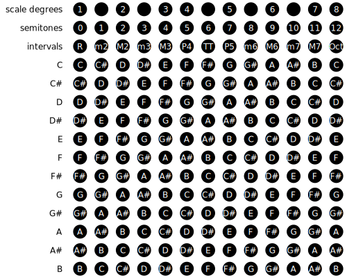
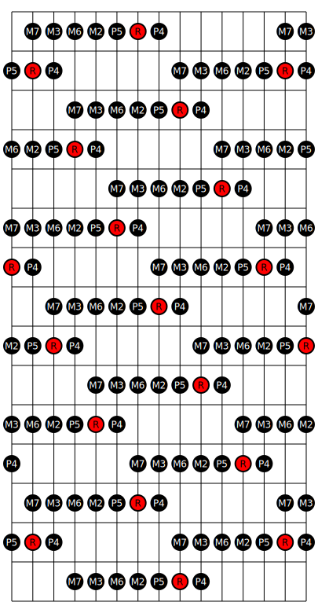
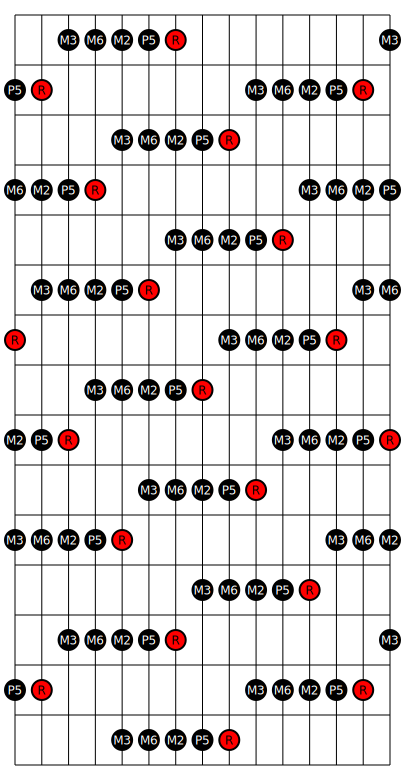

# Guitar Practice

Collection of notes and scripts I've made while guitar.

## Scales

### Major Scale

The following table shows how the major scale is constructed.

The following fretboard diagram shows the major scale laid out on a large fretboard
tuned with perfect fourth intervals between strings.

The images in [this folder](drawings/scales/) 
contain the major scale drawn out on a 6-string guitar with standard tuning.

### Major Pentatonic

